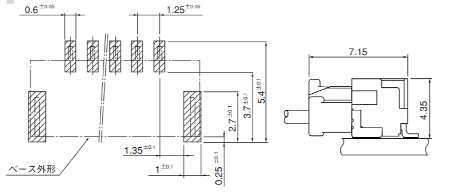
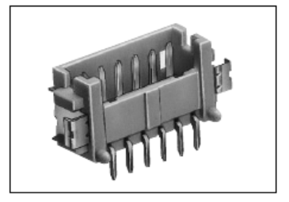
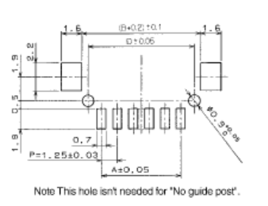
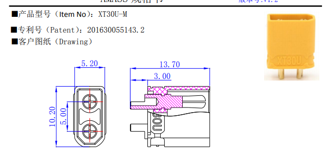
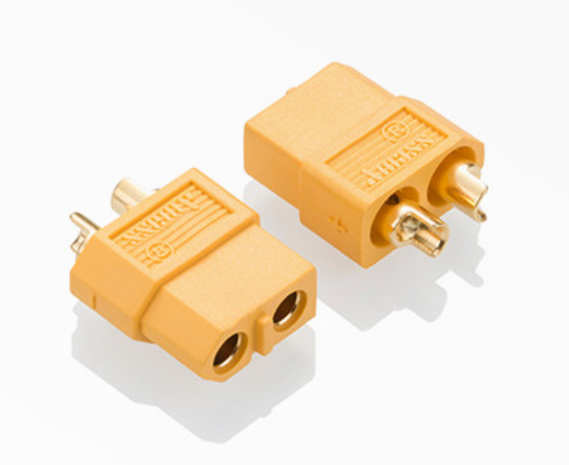

# Artinx 电子线材规范

## 1 接口规范

1. GH端子

特点：自锁卡扣

适应线径:26AWG至30AWG

耐流：MAX 1A(26AWG)

耐压：MAX 50V

可通过的信号：USART, CAN, SPI,(USB待测试)

优点：卡扣具有一定的防脱落能力，比杜邦线可靠；体积小

缺点：无法通过大电流；仍然无法承受较大拉力，极限情况下会出现胶壳被拉断、连接处线芯与外皮分离的等故障；现有官方线的长度难以满足要求，截断焊接会增加不稳定因素

2. 1.25 Pitch 微型连接器

 特点：SWD下载

适应线径:26AWG至30AWG

耐流：MAX 1A(26AWG)

耐压：MAX 150V

可通过的信号：SWD信号

优点：依靠胶壳之间的结构连接，具有较弱的防脱落能力，比杜邦线可靠，不如GH可靠；体积小

缺点：无法通过大电流；仍然无法承受较大拉力，极限情况下会出现胶壳被拉断、连接处线芯与外皮分离的等故障

3. XT30 接口

特点：大电流，分为焊线型与焊板型，分公母头

适应线径:推荐18AWG（3A），实际可以16AWG（5A）

耐流：峰值30A ，恒定15A

耐压：MAX 500V

可通过的电流：除直接连接电池外的大部分设备

优点：依靠金属触点之间的压力，具有较弱的防脱落能力；防呆防反接；

缺点：对焊接技术要求较高，偶尔出现虚焊的情况；需要对露出的触点用热缩管进行绝缘处理；如果机器人机电连线不合理，就会出现
公对公，母对母，XT30对XT60的奇怪组合

3. XT30 接口

特点：大电流，分为焊线型与焊板型，分公母头

适应线径:推荐12AWG（15A）

耐流：峰值60A ，恒定30A

耐压：MAX 500V

可通过的电流：一般是直接连接电池的设备

优点：依靠金属触点之间的压力，具有较弱的防脱落能力；防呆防反接；

缺点：对焊接技术要求较高，偶尔出现虚焊的情况；需要对露出的触点用热缩管进行绝缘处理；如果机器人机电连线不合理，就会出现
公对公，母对母，XT30对XT60的奇怪组合

4. 2.54mm 

4.1 排针排母

特点：拔插方便，适用于板间连接

耐流：3A

耐压：MAX 1000V

优点：依靠金属触点之间的压力，具有较弱的防脱落能力；无脑连接；对信号与电流都较为友好

缺点：在板上占地面积较大，适用于Demo版本

4.2 万恶的杜邦线

特点：拔插方便，完全不可靠

耐流：MAX 1A（26AWG），实际上一般的线最多0.5A

耐压：取决于线材，不大于500V

优点：拔插方便

缺点：

## 2 颜色规范
## 3 线径规范
## 4 制作规范