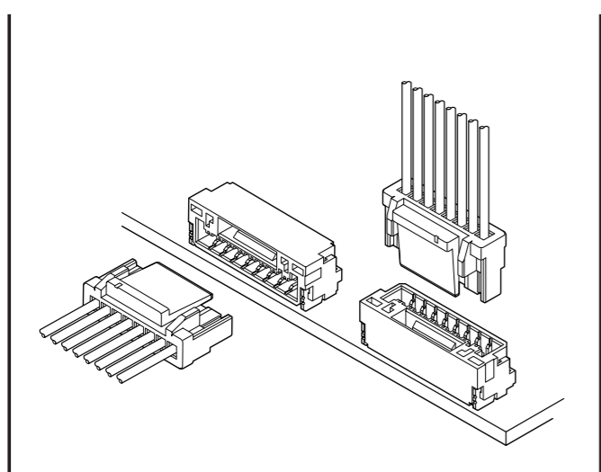
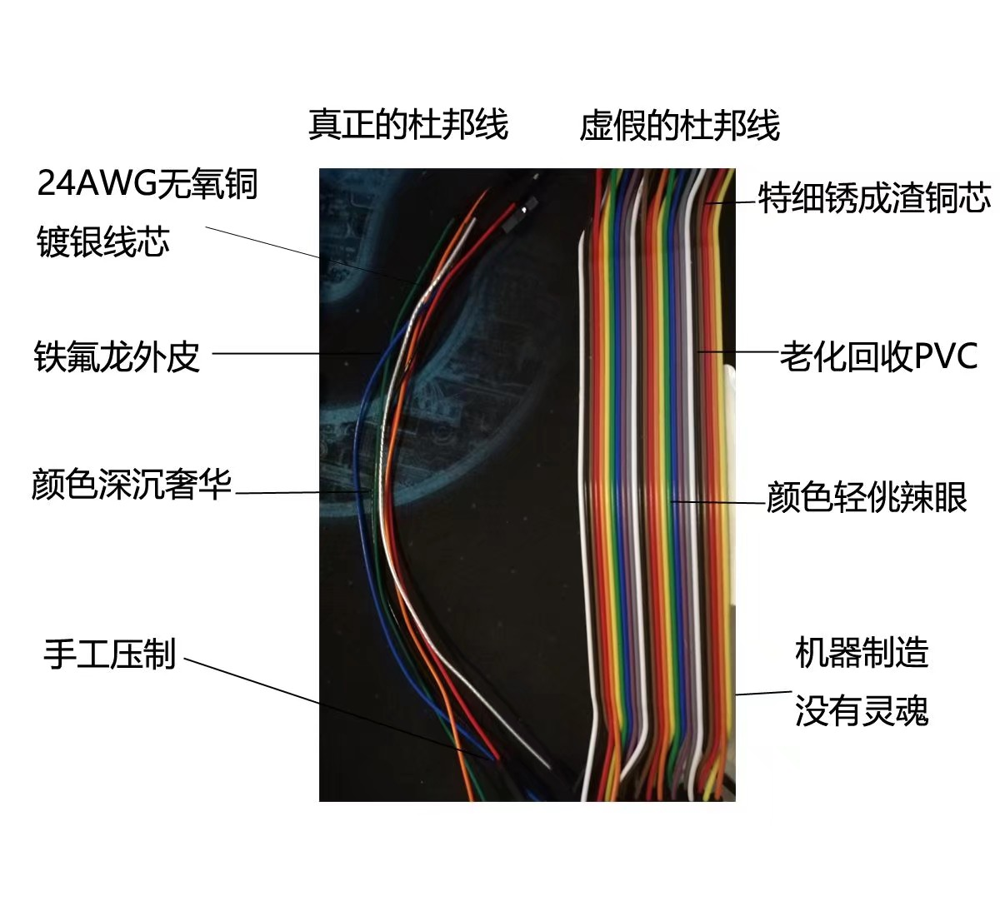

# Artinx 电子线材规范

## 1 接口规范

1. GH端子

特点：自锁卡扣

适应线径:26AWG至30AWG

耐流：MAX 1A(26AWG)

耐压：MAX 50V

可通过的信号：USART, CAN, SPI,(USB待测试)

优点：卡扣具有一定的防脱落能力，比杜邦线可靠；体积小

缺点：无法通过大电流；仍然无法承受较大拉力，极限情况下会出现胶壳被拉断、连接处线芯与外皮分离的等故障；现有官方线的长度难以满足要求，截断焊接会增加不稳定因素

2. 1.25 Pitch 微型连接器

 特点：SWD下载

适应线径:26AWG至30AWG

耐流：MAX 1A(26AWG)

耐压：MAX 150V

可通过的信号：SWD信号

优点：依靠胶壳之间的结构连接，具有较弱的防脱落能力，比杜邦线可靠，不如GH可靠；体积小

缺点：无法通过大电流；仍然无法承受较大拉力，极限情况下会出现胶壳被拉断、连接处线芯与外皮分离的等故障

3. XT30 接口

特点：大电流，分为焊线型与焊板型，分公母头

适应线径:推荐18AWG（3A），实际可以16AWG（5A）

耐流：峰值30A ，恒定15A

耐压：MAX 500V

可通过的电流：除直接连接电池外的大部分设备

优点：依靠金属触点之间的压力，具有较弱的防脱落能力；防呆防反接；

缺点：对焊接技术要求较高，偶尔出现虚焊的情况；需要对露出的触点用热缩管进行绝缘处理；如果机器人机电连线不合理，就会出现
公对公，母对母，XT30对XT60的奇怪组合

4. XT60 接口

特点：大电流，分为焊线型与焊板型，分公母头

适应线径:推荐12AWG（15A）

耐流：峰值60A ，恒定30A

耐压：MAX 500V

可通过的电流：一般是直接连接电池的设备

优点：依靠金属触点之间的压力，具有较弱的防脱落能力；防呆防反接；

缺点：对焊接技术要求较高，偶尔出现虚焊的情况；需要对露出的触点用热缩管进行绝缘处理；如果机器人机电连线不合理，就会出现
公对公，母对母，XT30对XT60的奇怪组合

5. 2.54mm 

5.1 排针排母

特点：拔插方便，适用于板间连接

耐流：3A

耐压：MAX 1000V

优点：依靠金属触点之间的压力，具有较弱的防脱落能力；无脑连接；对信号与电流都较为友好

缺点：在板上占地面积较大，适用于Demo版本

5.2 万恶的杜邦线

特点：拔插方便，完全不可靠，分公母头

耐流：MAX 1A（26AWG），实际上一般的线最多0.5A

耐压：取决于线材，不大于500V

优点：拔插方便

缺点：完全不可靠, 无法承受拉扯，易产生形变；劣质杜邦线甚至可能产生不可见的线芯腐蚀与断裂。

## 2 颜色规范

建议规定：
供电线中的正，建议使用红色附近的色系，如红橙黄。在可以明显区分线材电压时，可以都取红为正，黑为负。
一般情况下，24V取红，12V取橙，5V取黄。没有特殊要求时，GND统一为黑。

信号线一般线径为26AWG至30AWG，可以取 白、绿、蓝、紫、红、黑，灰，棕。

信号线颜色标准的意义是，能通过颜色区分逻辑上的TXD、RXD与CLK。

尊重传统，PWM信号和IIC的SDA为白，因为它们没有相对应的RXD。PWM需要与对应GND构成双绞。

CANH为红，CANL为黑，以双绞屏蔽为最高标准。如果同行的的线材中有26AWG的24V供电，CAN信号线必须有双绞或屏蔽的特征与之区分。

以主控板基准，UART的TXD和SPI的MOSI为绿，UART的RXD和SPI的MISO为蓝，SPI的CLK为紫，片选为灰。
如果同行线材中有UART和SPI，可以考虑在线材的两端用绿色胶带缠绕UART的TXD,RXD,GND；
用蓝色胶带缠绕SPI的MOSI,MISO,CLK,片选。

纯粹高低电平控制的信号线（如继电器），使用棕色或咖啡色。

USB直接使用灰色外皮的四芯屏蔽线。

实际线色规定还要与导电滑环配合。

强制规定：

线径大于等于16AWG，颜色为全红的线材，必定为24V主供电线中的正。
线径大于等于16AWG，颜色为全红的线材，必定为24V主供电线中的负。

线径小于等于26AWG，颜色为全红且处于屏蔽层之内，必定为CANH。
线径小于等于26AWG，颜色为全黑且处于屏蔽层之内，必定为CANL。

## 3 线径规范
## 4 制作规范